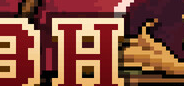

# TBH: Task Bar Hero for macOS

[](https://github.com/wenjiazhu1980/TBH/actions/workflows/ci.yml)
[](https://github.com/wenjiazhu1980/TBH/releases/latest)
[](https://www.swift.org/)
[](https://www.apple.com/macos/)

**TBH** is an unofficial macOS menu-bar idle RPG inspired by **Task Bar Hero**. It keeps a pixel hero in the macOS menu bar, runs a one-tick-per-second battle loop, collects loot, levels up, unlocks runes, and saves progress automatically.

<p align="center">
  
</p>

## Download

Download the latest packaged macOS build from [GitHub Releases](https://github.com/wenjiazhu1980/TBH/releases/latest).

If macOS blocks the downloaded app because it is unsigned, remove the quarantine attribute after reviewing the app path:

```bash
xattr -cr /Applications/TBH.app
open /Applications/TBH.app
```

## Why This Project Exists

TBH brings the **Task Bar Hero** idle RPG loop into a native SwiftUI `MenuBarExtra` app:

- **Menu-bar gameplay**: run the game from the macOS status bar instead of a normal window.
- **Idle RPG loop**: fight monsters, gain XP and gold, collect chests, open loot, and progress through stages.
- **Rune Tree progression**: unlock party slots, active skill slots, backpack space, chest automation, offline rewards, and combat bonuses.
- **Source-backed pixel assets**: extracted and audited hero, monster, item, rune, passive skill, icon, and SFX resources.
- **Offline progress**: earn capped offline gold and XP based on saved runtime state.
- **Local and CI audits**: gameplay fidelity, app icons, item icons, rune icons, hero sprites, SFX, and rendered battle scenes are guarded by scripts.

## Keywords

`Task Bar Hero`, `TBH`, `macOS menu bar game`, `SwiftUI MenuBarExtra`, `idle RPG`, `incremental game`, `pixel RPG`, `Swift Package Manager`, `GitHub Actions`, `macOS app`.

## Project Status

The current project focuses on a playable macOS adaptation with explicit fidelity boundaries. Some systems are source-backed and audited; others remain local scaffolds until enough reference evidence is available.

Important reference sources:

- [Task Bar Hero on Steam](https://store.steampowered.com/app/3678970/TBH_Task_Bar_Hero/)
- [Task Bar Hero Wiki](https://taskbarhero.wiki/)
- [TBH data mirror](https://tbh.city/)

## Tech Stack

| Area | Choice |
| --- | --- |
| Language | Swift 5.9+ |
| UI | SwiftUI, `MenuBarExtra`, AppKit integration where needed |
| Package manager | Swift Package Manager |
| Persistence | JSON save data in Application Support |
| Tests | Swift Testing on CI, built-in `--self-test` locally |
| CI/CD | GitHub Actions on `macos-latest` |
| Distribution | `.app`, `.zip`, and release artifacts |

## Quick Start

Build and run from the repository root:

```bash
swift build --disable-sandbox --disable-index-store
swift run --disable-sandbox --disable-index-store TBH
```

The app appears in the macOS menu bar. It does not open a large normal app window by default.

Run the local zero-dependency self-test:

```bash
swift run --disable-sandbox --disable-index-store TBH --self-test
```

Package a local app bundle:

```bash
scripts/package-app.sh
open dist/TBH.app
```

## Build, Test, and Audit

See [BUILDING.md](BUILDING.md) for the full local, remote, and GitHub Actions workflow.

Common commands:

```bash
swift build --disable-sandbox --disable-index-store
swift run --disable-sandbox --disable-index-store TBH --self-test
swift run --disable-sandbox --disable-index-store TBH --resource-self-test
scripts/audit-local-gameplay-fidelity.sh
scripts/audit-local-app-icons.sh
scripts/audit-local-item-icons.sh
scripts/audit-local-rune-icons.sh
scripts/audit-local-passive-skill-icons.sh
scripts/audit-local-hero-sprites.sh
scripts/audit-local-sfx.sh
RENDER_BATTLE_SCENE=1 scripts/audit-local-battle-scene.sh
scripts/package-app.sh
```

`swift test` requires a toolchain with Swift Testing support. On machines with only Command Line Tools, use `--self-test` and run the full Swift Testing suite in GitHub Actions or on a Mac with full Xcode.

## Repository Layout

```text
Sources/
  App/             App entry points, lifecycle checks, SelfTest, resource self-test
  Game/
    Engine/        GameEngine, tick loop, saving, equipment, reset, automation
    Character/     Hero classes, party members, active and passive skills
    Combat/        Battle model, monsters, damage calculation, battle logs
    Inventory/     Items, equipment slots, loot tables, chest handling
    Progress/      Chapters, stages, difficulties, Rune Tree, offline progress
  UI/              Menu bar extra, battle, inventory, character, chest, settings panels
  Persistence/     SaveManager and JSON save model
  Resources/
    Extracted/     Bundled pixel art, icons, source-backed sprites, WAV SFX
Tests/GameTests/   Swift Testing suites used by CI and full Xcode toolchains
scripts/           Packaging, audit, icon, sprite, SFX, and remote-build scripts
docs/              Fidelity reviews and source evidence notes
```

## Gameplay Loop

TBH uses one runtime tick per second. On each tick, the hero party and monster advance cooldowns, attack when ready, log combat events, and resolve victory or defeat. Victories grant paced XP, gold, chest rewards, and stage progress. Defeats revive the hero and restart the encounter. The game autosaves every 30 ticks and saves again on termination.

## GitHub Actions Releases

Pushing to `main`, opening pull requests, or pushing `v*` tags triggers CI. Tag builds create release artifacts through GitHub Actions:

```bash
git tag v0.3.7
git push origin v0.3.7
```

Release artifacts include packaged `TBH.app` zip output and, when DMG creation succeeds, a macOS installer image.

## Contributing

Before changing gameplay, pacing, UI layout, or assets:

1. Check [AGENTS.md](AGENTS.md) for contributor and reference-source rules.
2. Keep source-backed behavior separate from local scaffolding.
3. Add or update focused tests, `SelfTest`, and relevant `scripts/audit-local-*.sh` guards.
4. Include screenshots or rendered battle-scene evidence for UI, animation, icon, or sprite changes.

## Disclaimer

This repository is an unofficial macOS implementation inspired by Task Bar Hero. Task Bar Hero names, concepts, and reference materials belong to their respective owners. Use the Steam page and wiki sources above as references for fidelity checks.
